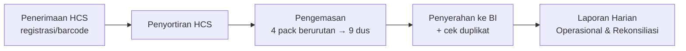
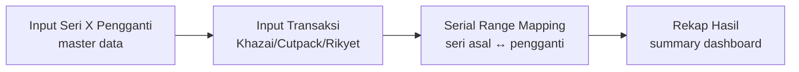

# Business Requirements Document (BRD)
## Khazprokhir — Sistem Operasional & Pelaporan HCS/HCTS

| Item | Nilai |
|------|-------|
| **Judul Dokumen** | Business Requirements Document — Khazprokhir |
| **Versi** | 1.0 |
| **Tanggal** | 7 Juli 2026 |
| **Status** | Draft untuk review tim IT |
| **Penulis** | Tim Pengembang Khazprokhir |
| **Audiens** | Manajemen / Business Owner, Tim IT, Stakeholder Fungsional |
| **Dokumen terkait** | `docs/SSD.md` (spesifikasi sistem), `docs/DEPLOYMENT.md` (panduan deploy) |

---

## 1. Latar Belakang & Tujuan Bisnis

### 1.1 Latar Belakang
Proses produksi uang kertas melibatkan alur panjang mulai dari penerimaan bilyet hasil cetak (HCS), penyortiran, pengemasan menjadi dus, hingga penyerahan kepada Bank Indonesia (BI). Selain itu terdapat alur paralel untuk pengelolaan persediaan siap kirim (HCTS) serta penanganan bilyet pengganti (X Pengganti) untuk bilyet rusak/cacat.

Sebelumnya pencatatan dan pelacakan dilakukan secara manual/terpisah sehingga rawan:
- Ketidakakuratan perhitungan akumulasi bilyet, dus, dan persediaan.
- Kesulitan menelusuri riwayat suatu bilyet/seri (traceability).
- Pelaporan harian dan rekonsiliasi yang lambat dan rentan kesalahan.
- Tidak adanya audit trail atas perubahan data.

### 1.2 Tujuan Bisnis
1. **Otomasi alur HCS** dari penerimaan → penyortiran → pengemasan → penyerahan BI.
2. **Akurasi pelacakan bilyet** pada skala besar (jutaan hingga miliaran bilyet) secara efisien.
3. **Pelaporan real-time** harian dan rekonsiliasi yang dapat diekspor (CSV/PDF).
4. **Auditabilitas** melalui pencatatan otomatis setiap aksi pengguna (Audit Log).
5. **Kontrol akses berbasis peran (role-based)** sesuai tanggung jawab tiap unit kerja.
6. **Manajemen X Pengganti** dengan pemetaan seri asal ↔ seri pengganti yang efisien dan bebas overlap.

---

## 2. Stakeholder

| Peran (role) | Tanggung Jawab Fungsional |
|--------------|----------------------------|
| **admin** | Administrator sistem: akses penuh ke seluruh modul, manajemen target & akun pengguna. |
| **supervisor** | Pengawas: akses baca (read-only) ke seluruh modul untuk monitoring tanpa mengubah data. |
| **khazai** | Operator Penerimaan HCS: CRUD penuh modul Registrasi Penerimaan HCS; baca modul lain. |
| **khazverutas** | Operator Verifikasi Uang Sambungan: CRUD penuh modul X Pengganti; baca modul lain. |
| **sortir** | Operator Penyortiran: akses penuh modul operasional kecuali manajemen target & akun. |
| **kemas** | Operator Pengemasan: akses penuh modul operasional kecuali manajemen target & akun. |
| **tamu (null)** | Pengguna baru belum memiliki peran: hanya Dashboard, Laporan Harian, dan profil sendiri. |

Detail teknis matriks akses dijelaskan pada `docs/SSD.md` §6 dan diimplementasikan pada `app/Http/Middleware/RoleMiddleware.php`.

---

## 3. Ruang Lingkup

### 3.1 In-Scope
- Modul Penerimaan HCS (registrasi, scan barcode, riwayat).
- Modul Penyortiran HCS + Rekomendasi Penerimaan & Penyortiran.
- Modul Pengemasan (4 pack → 9 dus) + Detail Pengemasan + Laporan Pengemasan.
- Modul Penyerahan ke BI (+ pemeriksaan duplikat nomor BA/dus).
- Modul HCTS: Penerimaan, Inventory, Submission (penyerahan HCTS).
- Modul Laporan Harian (operasional, rekonsiliasi, real-time, persediaan detail).
- Modul Manajemen Target (tahunan, bulanan, pengemasan).
- Modul Tracking / Traceability.
- Modul X Pengganti (seri, khazai, cutpack, rikyet, rekap, serial range mapping).
- Modul pendukung: Penyablonan, Bahan Penolong, Messages (pesan antar pengguna), Audit Log, Manajemen Pengguna.
- Autentikasi berbasis username + password (Laravel Breeze).
- Ekspor CSV dan cetak PDF (print-to-PDF browser).

### 3.2 Out-of-Scope
- Sistem/infrastruktur sisi Bank Indonesia (hanya output BA penyerahan).
- Aplikasi mobile native (UI bersifat web responsive).
- API publik/eksternal untuk konsumsi pihak ketiga.
- Integrasi mesin cetak/mesin sortir secara langsung (input masih manual/scan barcode).
- Modul keuangan/akuntansi, HR, payroll.
- Single Sign-On (SSO) Active Directory (autentikasi lokal database).

---

## 4. Glosarium Istilah Domain

| Istilah | Definisi |
|---------|----------|
| **Bilyet** | Satuan terkecil uang kertas: 1 lembar bilyet = 1 lembar uang. |
| **Brood** | 1.000 bilyet (1 prefix huruf seri × 1.000 nomor). |
| **Vell** | 45 bilyet; lembar besar belum dipotong. |
| **Pack** | 45 brood = 45.000 bilyet (45 prefix × 1.000 nomor). |
| **Dus** | Unit pengemasan = 20.000 bilyet. |
| **Batch** | 100 pack = 4.500.000 bilyet. |
| **Pecahan** | Denominasi uang: S, T, U, V, W, X, Y. |
| **Seri** | Identitas seri uang, format label `XX-XX9` (mis. `AB-BB7`). |
| **Prefix** | 3 huruf seri (mis. `ABA`); huruf ke-3 rotasi A-Z **skip I dan X**. |
| **X Pengganti** | Bilyet pengganti untuk bilyet rusak/cacat. |
| **HCS** | Hot Cash Sortir — alur penerimaan, sortir, kemas, serah ke BI. |
| **HCTS** | Hot Cash to Stock — alur persediaan siap kirim. |
| **TA** | Tahun Anggaran. |
| **TE / Emisi** | Tahun Emisi (tahun cetak). |
| **Gilir** | Gilir produksi: Gilir 1, Gilir 2, Gilir 3. |
| **Supplier** | Sumber bilyet: `Rikyet` atau `Cutpack`. |
| **Nomor BA** | Nomor Berita Acara penyerahan. |

---

## 5. Proses Bisnis Utama

### 5.1 Alur HCS (Penerimaan → Penyerahan BI)

**Penerimaan HCS**: Bilyet dari supplier (Rikyet/Cutpack) diterima dengan nomor bon, tanggal, pecahan, jumlah, gilir, mesin, batch, seri, dan emisi. Tersedia mode scan barcode dan registrasi formal. Riwayat penerimaan dapat ditelusuri per barcode.

**Penyortiran HCS**: Hasil sortir bilyet direkam. Sistem memberikan rekomendasi penerimaan dan penyortiran untuk membantu operator.

**Pengemasan**: Setiap 4 pack berurutan dikemas menjadi 9 dus (total 180.000 bilyet). Nomor dus bersifat sekuensial per kombinasi pecahan + tahun emisi + tahun anggaran. Detail pengemasan menghubungkan dus ke (batch, seri) spesifik.

**Penyerahan ke BI**: Dus diserahkan dengan nomor BA, nomor dus awal/akhir, dan jumlah bilyet. Sistem memeriksa duplikat nomor BA/dus sebelum disimpan.

### 5.2 Alur HCTS (Persediaan Siap Kirim)

Penerimaan HCTS mencatat bilyet siap kirim dengan nomor segel. Inventory menampilkan sisa persediaan per batch. Submission merekam penyerahan HCTS ke pihak terkait beserta batch-batch yang diserahkan.

### 5.3 Alur X Pengganti (Pemetaan Seri Pengganti)

Operator merekam seri X Pengganti sebagai master, kemudian mencatat transaksi penggantian (Khazai/Cutpack/Rikyet). Sistem memetakan range seri asal ke range seri pengganti secara efisien (1 brood = 1 baris, bukan per bilyet) dengan jaminan tidak ada range yang tumpang tindih. Rekap menampilkan ringkasan hasil penggantian.

---

## 6. Kebutuhan Fungsional per Modul

> ID format: `FR-<modul>-<nn>`. Modul inti dijabar; modul pendukung dirangkum.

### 6.1 Autentikasi & Profil (FR-AUTH)
- **FR-AUTH-01**: Login menggunakan username + password.
- **FR-AUTH-02**: Verifikasi email (opsional, bawaan Breeze).
- **FR-AUTH-03**: Pengelolaan profil sendiri (edit/update/hapus akun).
- **FR-AUTH-04**: Logout.
- **Aktor**: Semua pengguna terdaftar.

### 6.2 Dashboard (FR-DASH)
- **FR-DASH-01**: Ringkasan metrik operasional utama (jumlah penerimaan, pengemasan, penyerahan, persediaan).
- **FR-DASH-02**: Navigasi ke modul lain sesuai hak akses peran.
- **Aktor**: Semua peran (tamu terbatas).

### 6.3 Penerimaan HCS + Registrasi Khazai (FR-HCSR)
- **FR-HCSR-01**: Form input penerimaan HCS (nomor bon, tanggal, pecahan, jumlah, gilir, mesin, supplier, batch, seri, emisi).
- **FR-HCSR-02**: Daftar/edit/hapus penerimaan HCS.
- **FR-HCSR-03**: Mode scan barcode penerimaan + status scan.
- **FR-HCSR-04**: Konfirmasi manual penerimaan (manual-confirm).
- **FR-HCSR-05**: Riwayat penerimaan per barcode (history).
- **FR-HCSR-06**: Registrasi penerimaan formal (modul Khazai) dengan cetak barcode.
- **Aktor tulis**: khazai (CRUD pada `hcs-khazai-registration.*` saja), sortir/kemas/admin (CRUD penuh); supervisor & lainnya read-only.

### 6.4 Penyortiran HCS + Rekomendasi (FR-SORT)
- **FR-SORT-01**: Form input hasil penyortiran.
- **FR-SORT-02**: Daftar penyortiran.
- **FR-SORT-03**: Rekomendasi penerimaan (tampil + print + export).
- **FR-SORT-04**: Rekomendasi penyortiran.
- **FR-SORT-05**: Laporan penyortiran (index/export/print/edit/update/hapus).
- **Aktor**: sortir (CRUD), admin/supervisor (baca).

### 6.5 Pengemasan + Detail (FR-KMS)
- **FR-KMS-01**: Form input pengemasan (tanggal, gilir, TA/TE, pecahan, batch, seri, pack awal/akhir, jumlah pack/dus, dus awal/akhir).
- **FR-KMS-02**: Daftar & detail pengemasan.
- **FR-KMS-03**: Hapus pengemasan.
- **FR-KMS-04**: Data pengemasan + export + print.
- **FR-KMS-05**: Laporan pengemasan HCS (index + print).
- **FR-KMS-06**: Notifikasi HCS siap dikemas.
- **Aktor**: kemas (CRUD), admin/supervisor (baca).

### 6.6 Penyerahan ke BI (FR-BI)
- **FR-BI-01**: Form input penyerahan (tanggal, nomor BA, pecahan, TE, TA, nomor dus awal/akhir, jumlah dus/bilyet, status).
- **FR-BI-02**: Daftar/edit/hapus penyerahan.
- **FR-BI-03**: Export & print penyerahan.
- **FR-BI-04**: Pemeriksaan duplikat nomor BA/dus sebelum simpan.
- **Aktor**: kemas/sortir (CRUD), admin/supervisor (baca).

### 6.7 Laporan Harian (FR-LAP)
- **FR-LAP-01**: Laporan operasional harian dengan filter tanggal/tahun anggaran/tahun emisi.
- **FR-LAP-02**: Laporan rekonsiliasi dengan rentang tanggal + tahun anggaran.
- **FR-LAP-03**: Laporan real-time (refresh partial via AJAX).
- **FR-LAP-04**: Detail persediaan per pecahan (siap kemas/siap kirim/total).
- **FR-LAP-05**: Export CSV (dengan sanitasi CSV-injection).
- **FR-LAP-06**: Print/PDF (print-to-PDF browser).
- **Aktor**: semua peran (termasuk tamu).

### 6.8 Manajemen Target (FR-TGT) — *admin only*
- **FR-TGT-01**: CRUD target tahunan per pecahan/TA/TE.
- **FR-TGT-02**: CRUD target bulanan.
- **FR-TGT-03**: CRUD target bulanan pengemasan.
- **Aktor**: admin.

### 6.9 HCTS (FR-HCTS)
- **FR-HCTS-01**: Penerimaan HCTS (nomor bon, tanggal, pecahan, jumlah, batch, seri, emisi, TA, nomor segel) + CRUD.
- **FR-HCTS-02**: Inventory HCTS (sisa persediaan per batch) + detail batch.
- **FR-HCTS-03**: Submission HCTS (penyerahan per batch) + CRUD.
- **FR-HCTS-04**: Summary HCTS + export + print.
- **Aktor**: kemas/sortir (CRUD), admin/supervisor (baca).

### 6.10 Tracking / Traceability (FR-TRK)
- **FR-TRK-01**: Pelacakan bilyet/seri/dus lintas modul.
- **FR-TRK-02**: Batch tracking (status batch).
- **Aktor**: semua peran kecuali tamu.

### 6.11 X Pengganti (FR-XP)
- **FR-XP-01**: Input master seri X Pengganti (CRUD).
- **FR-XP-02**: Input transaksi Khazai (grid) + export PDF.
- **FR-XP-03**: Input transaksi Cutpack (grid kompleks) + export PDF.
- **FR-XP-04**: Input transaksi Rikyet (grid brood) + export PDF.
- **FR-XP-05**: Rekap hasil (summary dashboard) + print.
- **FR-XP-06**: Serial Range Mapping: input pack/brood/partial/vell/single, lookup, hapus per pack/session.
- **Aktor**: khazverutas (CRUD), admin (CRUD), supervisor (baca), lainnya (baca terbatas).

### 6.12 Modul Pendukung (Dirangkum)
- **Penyablonan** (FR-PBL): penerimaan, dus, kerusakan, laporan (+print). Input stok blanko.
- **Bahan Penolong** (FR-BP): persediaan, penerimaan, pemakaian, transaksi (CRUD), inventory export/print.
- **Messages** (FR-MSG): pesan antar pengguna (index/store/edit/update/destroy), mendukung parent (thread).
- **Audit Log** (FR-AL): pencatatan otomatis aksi pengguna (user, action, module, record_id).
- **User Management** (FR-USR): CRUD pengguna (admin only).

---

## 7. Aturan Bisnis Kritis

| ID | Aturan |
|----|--------|
| **BR-01** | Konversi unit: 1 brood = 1.000 bilyet; 1 pack = 45 brood = 45.000 bilyet; 1 dus = 20.000 bilyet; 1 batch = 100 pack = 4.500.000 bilyet. |
| **BR-02** | Format label seri: `XX-XX9` (mis. `AB-BB7`). Digit terakhir menunjukkan nomor pack (7 → pack 701–800). |
| **BR-03** | Prefix seri = 3 huruf. Huruf ke-3 rotasi A–Z **skip huruf I** (normal: 20 huruf A–U) dan **skip huruf X** untuk campuran (V,W,Y,Z). Total 24 huruf valid. |
| **BR-04** | Pengemasan: setiap 4 pack berurutan → 9 dus (total 180.000 bilyet). Dus ke-1 = campuran 4 pack; dus 2–9 = seri 1 & seri 2 per pack. |
| **BR-05** | Nomor dus sekuensial per kombinasi pecahan + tahun emisi + tahun anggaran. |
| **BR-06** | Serial number bilyet: `[3 huruf prefix][6 digit]`; nomor = `(pack_number × 1000) + (1..1000)`. Contoh pack 701 → 701001–702000. |
| **BR-07** | Serial Range Mapping: pemetaan 1 brood = 1 baris (bukan per bilyet). Rasio kompresi ~1000:1 untuk penggantian bulk. |
| **BR-08** | Range mapping tidak boleh tumpang tindih (overlap) untuk source range pada prefix+seri yang sama (dijaga oleh constraint database). |
| **BR-09** | Jumlah bilyet source harus sama dengan replacement (`source_end − source_start = replacement_end − replacement_start`). |
| **BR-10** | Range split: bilyet tunggal dalam range existing dipecah menjadi 3 bagian (left, single, right) untuk re-replacement. |
| **BR-11** | Penyerahan BI: pemeriksaan duplikat nomor BA/dus sebelum penyimpanan. |
| **BR-12** | Hanya admin yang dapat mengelola Target dan User Management. Supervisor hanya dapat melakukan operasi baca (GET). |

---

## 8. Kebutuhan Pelaporan & Ekspor

| Laporan | Modul | Filter | Output |
|---------|-------|--------|--------|
| Laporan Harian Operasional | Laporan Harian | tanggal, TA, TE | Tabel + CSV + Print/PDF |
| Rekonsiliasi | Laporan Harian | rentang tanggal, TA | Tabel + CSV + Print/PDF |
| Real-time | Laporan Harian | TA, TE (tanggal = hari ini) | Tabel partial AJAX |
| Persediaan Detail | Laporan Harian | pecahan, tanggal, TA, TE, jenis | Tabel detail |
| Laporan Pengemasan | Pengemasan | — | Tabel + Print |
| Laporan Penyerahan BI | Penyerahan BI | — | Tabel + Export + Print |
| Laporan Penyortiran | HCS Sorting | — | Tabel + Export + Print |
| Summary HCTS | HCTS | — | Tabel + Export + Print |
| Rekap X Pengganti | X Pengganti | seri | Summary + Print |
| Rekomendasi Penerimaan | HCS | — | Tampil + Print + Export |

**Catatan ekspor**: CSV dibangkitkan via `fputcsv` dengan sanitasi field CSV-injection (`sanitizeCsvField`). PDF dibangkitkan via print-to-PDF browser pada layout Blade yang dioptimalkan cetak.

---

## 9. Kebutuhan Non-Fungsional (Level Bisnis)

| ID | Kategori | Kebutuhan |
|----|----------|-----------|
| NFR-B-01 | Performa | Query pelacakan bilyet/seri pada skala besar (jutaan–miliaran bilyet) harus responsif (< 3 detik untuk laporan harian). |
| NFR-B-02 | Akurasi | Perhitungan akumulasi bilyet/dus/persediaan harus tepat 100% — tidak boleh selisih. |
| NFR-B-03 | Auditability | Setiap aksi tulis (create/update/delete) harus tercatat dengan identitas pengguna & waktu. |
| NFR-B-04 | Keamanan | Akses modul hanya untuk peran yang berwenang; data sensitif (password) terenkripsi. |
| NFR-B-05 | Availability | Sistem tersedia selama jam kerja produksi (min. 99% pada jam 07.00–22.00). |
| NFR-B-06 | Usability | UI responsif (mobile-first), dark mode, konsisten antar modul. |
| NFR-B-07 | Integritas Data | Tidak ada range seri yang tumpang tindih; jumlah source = replacement. |

---

## 10. Asumsi & Dependensi

- Infrastruktur PostgreSQL (versi 15+) tersedia dan terhubung (sistem wajib PostgreSQL — bukan kompatibel SQLite/MySQL).
- Server VM (Linux) tersedia untuk deployment (lihat `docs/DEPLOYMENT.md`).
- Akun pengguna dibuat oleh admin; autentikasi memakai database lokal (bukan AD/SSO).
- Data master (pecahan, seri, target) diisi oleh admin sebelum modul operasional dipakai.
- Operator memiliki perangkat pemindai barcode untuk modul penerimaan HCS.

---

## 11. Kriteria Penerimaan

- [ ] Semua modul inti (FR-AUTH s/d FR-XP) dapat diakses sesuai matriks peran.
- [ ] Login dengan username + password berhasil untuk setiap peran.
- [ ] Alur HCS end-to-end (penerimaan → penyortiran → pengemasan → penyerahan BI) terekam dan muncul di Laporan Harian.
- [ ] Pengemasan 4 pack menghasilkan 9 dus dengan perhitungan bilyet tepat.
- [ ] Pemeriksaan duplikat penyerahan BI berfungsi (menolak duplikat).
- [ ] Serial Range Mapping menolak range overlap dan menolak ketidakcocokan jumlah.
- [ ] Range split bilyet tunggal menghasilkan 3 fragmen dengan total bilyet tetap.
- [ ] Laporan Harian & Rekonsiliasi tampil tanpa error dengan filter valid.
- [ ] Export CSV & Print/PDF menghasilkan output yang dapat dibuka/dicetak.
- [ ] Audit Log mencatat aksi tulis dengan identitas pengguna.
- [ ] Supervisor tidak dapat melakukan operasi tulis (POST/PUT/DELETE ditolak).
- [ ] Akun tamu (null) hanya dapat akses Dashboard, Laporan Harian, dan Profil.

---

*Dokumen ini mengacu pada state source code per 7 Juli 2026. Bila ada perubahan modul atau aturan bisnis signifikan, perbarui bagian terkait.*
