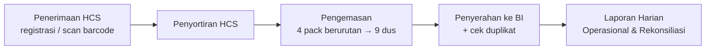
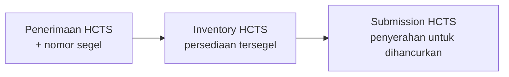
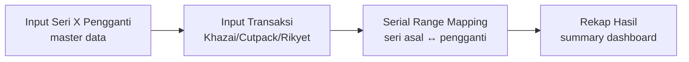

# Business Requirement Document (BRD)
## Khazprokhir — Sistem Operasional & Pelaporan HCS/HCTS

> **Apa itu BRD?** Business Requirement Document menjawab pertanyaan **"Why"** — *mengapa* proyek ini dibangun, tujuan bisnis apa yang ingin dicapai, dan ekspektasi siapa saja yang terlibat. Ditulis dalam bahasa bisnis (non-teknis), bukan tempat untuk membahas pilihan database atau framework.
> *(Acuan struktur: M Habibullah HS — "Understanding BRD, PRD, SDD & TSD", Medium, 3 Mei 2025)*

| Item | Nilai |
|------|-------|
| **Judul Dokumen** | Business Requirement Document — Khazprokhir |
| **Versi** | 2.0 |
| **Tanggal** | 8 Juli 2026 |
| **Status** | Draft untuk review tim IT |
| **Penulis** | Tim Pengembang Khazprokhir |
| **Audiens utama** | Business Owner, Product Owner, Business Analyst, C-level, Manajemen |
| **Dokumen terkait** | `docs/SDD.md` (desain sistem), `docs/DEPLOYMENT.md` (panduan deploy) |

---

## 1. Executive Summary

Khazprokhir adalah sistem informasi operasional yang mengelola siklus hidup **bilyet uang kertas** sejak diterima dari mesin cetak hingga diserahkan kepada Bank Indonesia (BI) atau dimusnahkan. Sistem dibangun untuk menggantikan pencatatan manual yang rawan kesalahan pada skala jutaan hingga miliaran bilyet.

Bilyet uang hasil cetak terbagi menjadi dua kategori yang alurnya berbeda:

- **HCS (Hasil Cetak Sempurna)** — bilyet yang lolos kendali mutu, kondisi sempurna. Bilyet ini masuk alur operasional: penerimaan → penyortiran → pengemasan → **penyerahan kepada BI untuk diedarkan**.
- **HCTS (Hasil Cetak Tidak Sempurna)** — bilyet rusak/cacat yang tidak layak diedarkan. Bilyet ini dikelola dalam persediaan tersegel lalu **diserahkan untuk dihancurkan/dimusnahkan**.

Selain itu, bilyet rusak dapat diganti dengan **X Pengganti** — bilyet pengganti yang dipetakan satu-ke-satu terhadap seri asal yang rusak, sehingga pelacakan nomor seri tetap akurat.

Sistem menyediakan pelaporan harian real-time, rekonsiliasi, kontrol akses berbasis peran, dan jejak audit penuh atas setiap perubahan data.

---

## 2. Business Goals & KPIs

### 2.1 Tujuan Bisnis
| ID | Tujuan |
|----|--------|
| **BG-01** | Mengotomasi alur HCS (Hasil Cetak Sempurna) dari penerimaan hingga penyerahan ke BI. |
| **BG-02** | Mengelola HCTS (Hasil Cetak Tidak Sempurna) dari penerimaan tersegel hingga penyerahan untuk pemusnahan. |
| **BG-03** | Menjamin akurasi perhitungan bilyet, pack, dan dus pada skala besar (jutaan–miliaran bilyet). |
| **BG-04** | Menyediakan pelaporan harian & rekonsiliasi real-time yang dapat diekspor. |
| **BG-05** | Menjamin ketertelusuran (traceability) setiap bilyet/seri melalui pemetaan X Pengganti. |
| **BG-06** | Mencatat jejak audit setiap aksi pengguna untuk akuntabilitas. |
| **BG-07** | Membatasi akses modul sesuai tanggung jawab tiap unit kerja (kontrol berbasis peran). |

### 2.2 Key Performance Indicators (KPIs)
| KPI | Target |
|-----|--------|
| Akurasi akumulasi bilyet (selisih antara sistem vs fisik) | 0 selisih |
| Waktu penyusunan Laporan Harian | < 3 detik (dari manual berjam-jam) |
| Ketertelusuran bilyet rusak → pengganti | 100% (tidak ada seri yang hilang jejaknya) |
| Ketersediaan sistem pada jam kerja produksi | ≥ 99% (07.00–22.00) |
| Pengecekan duplikat penyerahan BI | 100% duplikat terdeteksi sebelum disimpan |
| Pemetaan X Pengganti tanpa overlap range | 100% (constraint database menjamin) |

---

## 3. Stakeholders

| Peran (role) | Tanggung Jawab Bisnis |
|--------------|------------------------|
| **admin** | Administrator sistem: akses penuh ke seluruh modul, mengelola target produksi & akun pengguna. |
| **supervisor** | Pengawas/penyelia: memantau seluruh modul secara baca (read-only) tanpa mengubah data. |
| **khazai** | Operator Penerimaan HCS: mencatat & mengelola registrasi penerimaan Hasil Cetak Sempurna (termasuk scan barcode). |
| **khazverutas** | Operator Verifikasi Uang Sambungan: mengelola modul X Pengganti (pencatatan & pemetaan seri pengganti). |
| **sortir** | Operator Penyortiran: menjalankan kegiatan penyortiran & operasional HCS. |
| **kemas** | Operator Pengemasan: menjalankan pengemasan bilyet menjadi dus & operasional terkait. |
| **tamu (null)** | Pengguna baru belum diberi peran: hanya dapat melihat Dashboard, Laporan Harian, dan profil sendiri. |

> Detail teknis pembagian akses dijelaskan pada `docs/SDD.md` §5 (Security Considerations).

---

## 4. Ruang Lingkup

### 4.1 In-Scope
- **Alur HCS (Hasil Cetak Sempurna):** penerimaan (registrasi + scan barcode) → penyortiran → pengemasan (4 pack → 9 dus) → penyerahan ke BI (untuk diedarkan).
- **Alur HCTS (Hasil Cetak Tidak Sempurna):** penerimaan tersegel → inventory (persediaan) → submission (penyerahan untuk dihancurkan/dimusnahkan).
- **Modul X Pengganti:** input seri pengganti (Khazai/Cutpack/Rikyet), pemetaan range seri asal ↔ pengganti, rekap hasil.
- **Pelaporan:** Laporan Harian (operasional, rekonsiliasi, real-time, rincian persediaan), export CSV & cetak PDF.
- **Manajemen Target:** target tahunan, bulanan (penyerahan & pengemasan).
- **Tracking / Traceability:** pelacakan bilyet/seri/batch lintas modul.
- **Modul pendukung:** Penyablonan, Bahan Penolong, Messages (pesan antar pengguna), Audit Log, Manajemen Pengguna.
- Autentikasi berbasis username + password.

### 4.2 Out-of-Scope
- Sistem/infrastruktur sisi Bank Indonesia (hanya menghasilkan output Berita Acara penyerahan).
- Aplikasi mobile native (antarmuka berbasis web responsif).
- API publik/eksternal untuk pihak ketiga.
- Integrasi langsung dengan mesin cetak/mesin sortir (input masih manual/scan barcode).
- Modul keuangan/akuntansi, HR, payroll.
- Single Sign-On (SSO) Active Directory (autentikasi lokal database).
- Proses fisik pemusnahan HCTS (sistem hanya mencatat penyerahan untuk dimusnahkan, bukan eksekusi penghancuran).

---

## 5. Glosarium Istilah Domain

| Istilah | Definisi |
|---------|----------|
| **HCS** | **Hasil Cetak Sempurna** — bilyet uang lolos kendali mutu, kondisi sempurna, layak diedarkan. |
| **HCTS** | **Hasil Cetak Tidak Sempurna** — bilyet uang rusak/cacat, tidak layak diedarkan, akan dihancurkan/dimusnahkan. |
| **X Pengganti** | Bilyet pengganti untuk bilyet rusak; dipetakan satu-ke-satu terhadap seri asal yang rusak. |
| **Bilyet** | Satuan terkecil uang kertas: 1 lembar bilyet = 1 lembar uang. |
| **Brood** | 1.000 bilyet (1 prefix huruf seri × 1.000 nomor). |
| **Vell** | 45 bilyet; lembar besar belum dipotong. |
| **Pack** | 45 brood = 45.000 bilyet (45 prefix × 1.000 nomor). |
| **Dus** | Unit pengemasan = 20.000 bilyet. |
| **Batch** | 100 pack = 4.500.000 bilyet. |
| **Pecahan** | Denominasi uang: S, T, U, V, W, X, Y. |
| **Seri** | Identitas seri uang, format label `XX-XX9` (mis. `AB-BB7`). |
| **Prefix** | 3 huruf seri (mis. `ABA`); huruf ke-3 rotasi A-Z **skip I dan X**. |
| **TA** | Tahun Anggaran. |
| **TE / Emisi** | Tahun Emisi (tahun cetak). |
| **Gilir** | Gilir produksi: Gilir 1, Gilir 2, Gilir 3. |
| **Supplier** | Sumber bilyet: `Rikyet` atau `Cutpack`. |
| **Nomor BA** | Nomor Berita Acara penyerahan. |
| **Nomor Segel** | Pengaman pada penerimaan HCTS untuk ketertelusuran bilyet tidak sempurna. |

---

## 6. Proses Bisnis Utama

### 6.1 Alur HCS (Hasil Cetak Sempurna → Diedarkan)

Bilyet **Hasil Cetak Sempurna** dari supplier (Rikyet/Cutpack) diterima dengan nomor bon, tanggal, pecahan, jumlah, gilir, mesin, batch, seri, dan emisi. Tersedia mode scan barcode dan registrasi formal. Setelah disortir, bilyet dikemas: setiap 4 pack berurutan menjadi 9 dus (total 180.000 bilyet), nomor dus sekuensial per kombinasi pecahan + tahun emisi + tahun anggaran. Dus kemudian diserahkan kepada Bank Indonesia dengan nomor BA — sistem memeriksa duplikat nomor BA/dus sebelum menyimpan.

### 6.2 Alur HCTS (Hasil Cetak Tidak Sempurna → Dimusnahkan)

Bilyet **Hasil Cetak Tidak Sempurna** (rusak/cacat) diterima dengan nomor segel sebagai pengaman & penanda ketertelusuran. Bilyet disimpan dalam inventory sebagai persediaan tersegel. Ketika tiba waktunya, bilyet diserahkan (submission) untuk **dihancurkan/dimusnahkan** — sistem mencatat penyerahan beserta batch-batch yang dimusnahkan.

### 6.3 Alur X Pengganti (Penggantian Bilyet Rusak)

Bilyet rusak perlu diganti. Operator merekam seri X Pengganti sebagai master, kemudian mencatat transaksi penggantian (Khazai/Cutpack/Rikyet). Sistem memetakan range seri asal (yang rusak) ke range seri pengganti secara efisien (1 brood = 1 baris, bukan per bilyet) dengan jaminan tidak ada range yang tumpang tindih. Rekap menampilkan ringkasan hasil penggantian.

---

## 7. Kebutuhan Fungsional per Modul

> ID format: `FR-<modul>-<nn>`. Modul inti dijabar; modul pendukung dirangkum.

### 7.1 Autentikasi & Profil (FR-AUTH)
- **FR-AUTH-01**: Login menggunakan username + password.
- **FR-AUTH-02**: Verifikasi email (opsional).
- **FR-AUTH-03**: Pengelolaan profil sendiri (edit/update/hapus akun).
- **FR-AUTH-04**: Logout.
- **Aktor**: Semua pengguna terdaftar.

### 7.2 Dashboard (FR-DASH)
- **FR-DASH-01**: Ringkasan metrik operasional utama (penerimaan, pengemasan, penyerahan, persediaan).
- **FR-DASH-02**: Navigasi ke modul lain sesuai hak akses.
- **Aktor**: Semua peran (tamu terbatas).

### 7.3 Penerimaan HCS + Registrasi Khazai (FR-HCSR)
- **FR-HCSR-01**: Form input penerimaan HCS (nomor bon, tanggal, pecahan, jumlah, gilir, mesin, supplier, batch, seri, emisi).
- **FR-HCSR-02**: Daftar/edit/hapus penerimaan HCS.
- **FR-HCSR-03**: Mode scan barcode penerimaan + status scan.
- **FR-HCSR-04**: Konfirmasi manual penerimaan.
- **FR-HCSR-05**: Riwayat penerimaan per barcode.
- **FR-HCSR-06**: Registrasi penerimaan formal (modul Khazai) dengan cetak barcode.
- **Aktor tulis**: khazai (CRUD pada registrasi penerimaan saja), sortir/kemas/admin (CRUD penuh); supervisor & lainnya read-only.

### 7.4 Penyortiran HCS + Rekomendasi (FR-SORT)
- **FR-SORT-01**: Form input hasil penyortiran.
- **FR-SORT-02**: Daftar penyortiran.
- **FR-SORT-03**: Rekomendasi penerimaan (tampil + print + export).
- **FR-SORT-04**: Rekomendasi penyortiran.
- **FR-SORT-05**: Laporan penyortiran (index/export/print/edit/update/hapus).
- **Aktor**: sortir (CRUD), admin/supervisor (baca).

### 7.5 Pengemasan + Detail (FR-KMS)
- **FR-KMS-01**: Form input pengemasan (tanggal, gilir, TA/TE, pecahan, batch, seri, pack awal/akhir, jumlah pack/dus, dus awal/akhir).
- **FR-KMS-02**: Daftar & detail pengemasan.
- **FR-KMS-03**: Hapus pengemasan.
- **FR-KMS-04**: Data pengemasan + export + print.
- **FR-KMS-05**: Laporan pengemasan HCS (index + print).
- **FR-KMS-06**: Notifikasi HCS siap dikemas.
- **Aktor**: kemas (CRUD), admin/supervisor (baca).

### 7.6 Penyerahan ke BI (FR-BI)
- **FR-BI-01**: Form input penyerahan (tanggal, nomor BA, pecahan, TE, TA, nomor dus awal/akhir, jumlah dus/bilyet, status).
- **FR-BI-02**: Daftar/edit/hapus penyerahan.
- **FR-BI-03**: Export & print penyerahan.
- **FR-BI-04**: Pemeriksaan duplikat nomor BA/dus sebelum simpan.
- **Aktor**: kemas/sortir (CRUD), admin/supervisor (baca).

### 7.7 Laporan Harian (FR-LAP)
- **FR-LAP-01**: Laporan operasional harian dengan filter tanggal/tahun anggaran/tahun emisi.
- **FR-LAP-02**: Laporan rekonsiliasi dengan rentang tanggal + tahun anggaran.
- **FR-LAP-03**: Laporan real-time (refresh partial via AJAX).
- **FR-LAP-04**: Rincian persediaan per pecahan (siap kemas/siap kirim/total).
- **FR-LAP-05**: Export CSV (dengan sanitasi CSV-injection).
- **FR-LAP-06**: Print/PDF (print-to-PDF browser).
- **Aktor**: semua peran (termasuk tamu).

### 7.8 Manajemen Target (FR-TGT) — *admin only*
- **FR-TGT-01**: CRUD target tahunan per pecahan/TA/TE.
- **FR-TGT-02**: CRUD target bulanan.
- **FR-TGT-03**: CRUD target bulanan pengemasan.
- **Aktor**: admin.

### 7.9 HCTS — Hasil Cetak Tidak Sempurna (FR-HCTS)
- **FR-HCTS-01**: Penerimaan HCTS (nomor bon, tanggal, pecahan, jumlah, batch, seri, emisi, TA, **nomor segel**) + CRUD.
- **FR-HCTS-02**: Inventory HCTS (sisa persediaan tersegel per batch) + detail batch.
- **FR-HCTS-03**: Submission HCTS (penyerahan untuk dihancurkan) per batch + CRUD.
- **FR-HCTS-04**: Summary HCTS + export + print.
- **Aktor**: kemas/sortir (CRUD), admin/supervisor (baca).

### 7.10 Tracking / Traceability (FR-TRK)
- **FR-TRK-01**: Pelacakan bilyet/seri/dus lintas modul.
- **FR-TRK-02**: Batch tracking (status batch).
- **Aktor**: semua peran kecuali tamu.

### 7.11 X Pengganti (FR-XP)
- **FR-XP-01**: Input master seri X Pengganti (CRUD).
- **FR-XP-02**: Input transaksi Khazai (grid) + export PDF.
- **FR-XP-03**: Input transaksi Cutpack (grid kompleks) + export PDF.
- **FR-XP-04**: Input transaksi Rikyet (grid brood) + export PDF.
- **FR-XP-05**: Rekap hasil (summary dashboard) + print.
- **FR-XP-06**: Serial Range Mapping: input pack/brood/partial/vell/single, lookup, hapus per pack/session.
- **Aktor**: khazverutas (CRUD), admin (CRUD), supervisor (baca), lainnya (baca terbatas).

### 7.12 Modul Pendukung (Dirangkum)
- **Penyablonan** (FR-PBL): penerimaan, dus, kerusakan, laporan (+print). Input stok blanko.
- **Bahan Penolong** (FR-BP): persediaan, penerimaan, pemakaian, transaksi (CRUD), inventory export/print.
- **Messages** (FR-MSG): pesan antar pengguna, mendukung thread.
- **Audit Log** (FR-AL): pencatatan otomatis aksi pengguna (user, action, module, record_id).
- **User Management** (FR-USR): CRUD pengguna (admin only).

---

## 8. Aturan Bisnis Kritis

| ID | Aturan |
|----|--------|
| **BR-01** | HCS = Hasil Cetak Sempurna (layak diedarkan → diserahkan ke BI). HCTS = Hasil Cetak Tidak Sempurna (rusak → dimusnahkan). Keduanya tidak boleh tertukar alur. |
| **BR-02** | Konversi unit: 1 brood = 1.000 bilyet; 1 pack = 45 brood = 45.000 bilyet; 1 dus = 20.000 bilyet; 1 batch = 100 pack = 4.500.000 bilyet. |
| **BR-03** | Format label seri: `XX-XX9` (mis. `AB-BB7`). Digit terakhir menunjukkan nomor pack (7 → pack 701–800). |
| **BR-04** | Prefix seri = 3 huruf. Huruf ke-3 rotasi A–Z **skip huruf I** (normal: 20 huruf A–U) dan **skip huruf X** untuk campuran (V,W,Y,Z). Total 24 huruf valid. |
| **BR-05** | Pengemasan: setiap 4 pack berurutan → 9 dus (total 180.000 bilyet). Dus ke-1 = campuran 4 pack; dus 2–9 = seri 1 & seri 2 per pack. |
| **BR-06** | Nomor dus sekuensial per kombinasi pecahan + tahun emisi + tahun anggaran. |
| **BR-07** | Serial number bilyet: `[3 huruf prefix][6 digit]`; nomor = `(pack_number × 1000) + (1..1000)`. Contoh pack 701 → 701001–702000. |
| **BR-08** | Serial Range Mapping X Pengganti: pemetaan 1 brood = 1 baris (bukan per bilyet). Rasio kompresi ~1000:1. |
| **BR-09** | Range mapping X Pengganti tidak boleh tumpang tindih (overlap) untuk source range pada prefix+seri yang sama. |
| **BR-10** | Jumlah bilyet source harus sama dengan replacement (`source_end − source_start = replacement_end − replacement_start`). |
| **BR-11** | Range split: bilyet tunggal dalam range existing dipecah menjadi 3 bagian (left, single, right) untuk re-replacement. |
| **BR-12** | Penyerahan BI (HCS): pemeriksaan duplikat nomor BA/dus sebelum penyimpanan. |
| **BR-13** | Penerimaan HCTS wajib mencatat nomor segel untuk ketertelusuran bilyet tidak sempurna sebelum dimusnahkan. |
| **BR-14** | Hanya admin yang dapat mengelola Target dan User Management. Supervisor hanya dapat melakukan operasi baca (GET). |

---

## 9. Risks & Assumptions

### 9.1 Risiko Bisnis
| Risiko | Dampak | Mitigasi |
|--------|--------|----------|
| Pertukaran alur HCS vs HCTS (bilyet sempurna salah masuk alur pemusnahan atau sebaliknya) | Sangat tinggi — bilyet bernilai rusak atau bilyet rusak diedarkan | Kontrol akses berbasis peran; verifikasi operator; nomor segel HCTS |
| Selisih perhitungan bilyet vs fisik | Tinggi — kerugian/kelebihan stok | Akurasi sistem 100%; rekonsiliasi harian; audit log |
| Range seri pengganti tumpang tindih | Tinggi — bilyet hilang jejak / double replacement | Constraint database menolak overlap otomatis |
| Duplikat penyerahan BI | Sedang — BA ganda, masalah administratif | Pemeriksaan duplikat sebelum simpan |
| Ketergantungan pada PostgreSQL | Sedang — tidak portabel ke DB lain | Dokumentasi kewajiban PostgreSQL; backup rutin |

### 9.2 Asumsi
- Infrastruktur PostgreSQL tersedia dan terhubung (sistem wajib PostgreSQL).
- Server VM tersedia untuk deployment (lihat `docs/DEPLOYMENT.md`).
- Akun pengguna dibuat oleh admin; autentikasi memakai database lokal (bukan AD/SSO).
- Data master (pecahan, seri, target) diisi admin sebelum modul operasional dipakai.
- Operator memiliki perangkat pemindai barcode untuk modul penerimaan HCS.
- Proses fisik pemusnahan HCTS dilakukan di luar sistem; sistem hanya mencatat penyerahan.

---

## 10. Kriteria Penerimaan

- [ ] Semua modul inti dapat diakses sesuai matriks peran.
- [ ] Login dengan username + password berhasil untuk setiap peran.
- [ ] Alur HCS end-to-end (penerimaan → penyortiran → pengemasan → penyerahan BI) terekam dan muncul di Laporan Harian.
- [ ] Alur HCTS end-to-end (penerimaan tersegel → inventory → submission untuk dimusnahkan) terekam dengan nomor segel.
- [ ] Pengemasan 4 pack menghasilkan 9 dus dengan perhitungan bilyet tepat.
- [ ] Pemeriksaan duplikat penyerahan BI berfungsi (menolak duplikat).
- [ ] Serial Range Mapping X Pengganti menolak range overlap & menolak ketidakcocokan jumlah.
- [ ] Range split bilyet tunggal menghasilkan 3 fragmen dengan total bilyet tetap.
- [ ] Laporan Harian & Rekonsiliasi tampil tanpa error dengan filter valid.
- [ ] Export CSV & Print/PDF menghasilkan output yang dapat dibuka/dicetak.
- [ ] Audit Log mencatat aksi tulis dengan identitas pengguna.
- [ ] Supervisor tidak dapat melakukan operasi tulis (POST/PUT/DELETE ditolak).
- [ ] Akun tamu (null) hanya dapat akses Dashboard, Laporan Harian, dan Profil.

---

*Dokumen BRD ini menjelaskan **mengapa** sistem dibangun dan **apa** tujuan bisnisnya. Untuk **bagaimana sistem dirancang** (arsitektur, modul, basis data) lihat `docs/SDD.md`. Dokumen mengacu pada state source code per 8 Juli 2026.*
