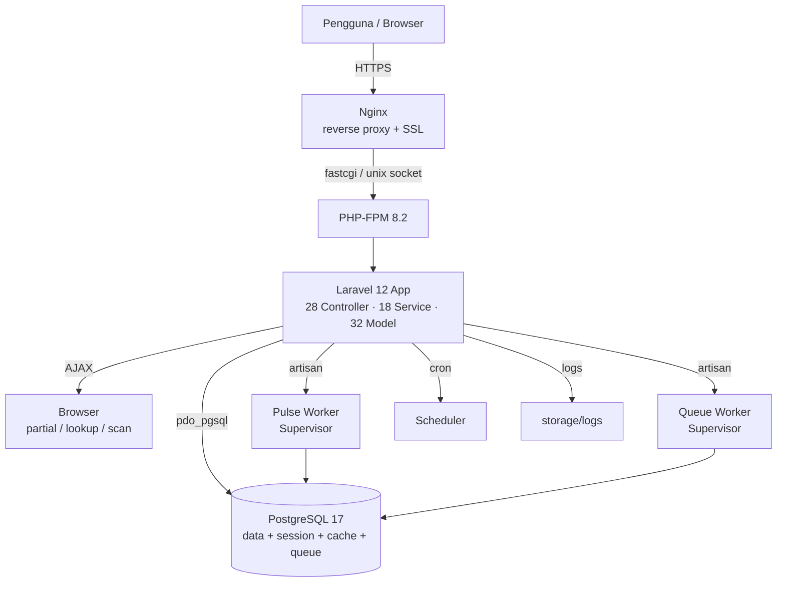
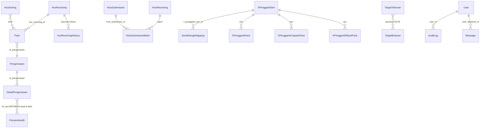

# System Specification Document (SSD)
## Khazprokhir — Spesifikasi Sistem & Arsitektur

| Item | Nilai |
|------|-------|
| **Judul Dokumen** | System Specification Document — Khazprokhir |
| **Versi** | 1.0 |
| **Tanggal** | 7 Juli 2026 |
| **Status** | Draft untuk review tim IT |
| **Audiens** | Tim IT / SysOps / Developer |
| **Dokumen terkait** | `docs/BRD.md` (kebutuhan bisnis), `docs/DEPLOYMENT.md` (panduan deploy VM) |

---

## 1. Gambaran Sistem & Arsitektur

Khazprokhir adalah aplikasi web monolitik berbasis **Laravel 12** dengan pola **MVC + Service Layer**. Frontend dirender server-side (Blade) dengan interaktivitas Alpine.js; aset dikompilasi via Vite. Database PostgreSQL berperan ganda sebagai penyimpan data aplikasi **maupun** driver session, cache, dan queue.

### 1.1 Arsitektur Tier



### 1.2 Pola Aplikasi
- **Controller** (`app/Http/Controllers`, 28 file): menangani HTTP, validasi, dan orkestrasi.
- **Service** (`app/Services`, 18 file): logika bisnis & agregasi data, dapat diuji terpisah dari HTTP.
- **Model** (`app/Models`, 32 file): representasi Eloquent + relasi.
- **Middleware** (`app/Http/Middleware/RoleMiddleware.php`): kontrol akses berbasis peran.
- **Blade** (`resources/views`): template server-side, layout `layouts.app`, partial report.

---

## 2. Tech Stack

### 2.1 Versi Spesifik (dari `composer.json` & `package.json`)

| Komponen | Versi | Sumber |
|----------|-------|--------|
| PHP | ^8.2 (8.2/8.3/8.4) | `composer.json` |
| Laravel Framework | ^12.0 | `composer.json` |
| Laravel Pulse | ^1.7 | `composer.json` |
| Laravel Tinker | ^2.10.1 | `composer.json` |
| Laravel Breeze | ^2.3 (dev) | `composer.json` |
| Spatie Ignition | ^2.12 (dev) | `composer.json` |
| PHPUnit | ^11.5.3 (dev) | `composer.json` |
| Node.js | 18+ (24 dipakai di dev) | `docker/8.2/Dockerfile` |
| Vite | ^7.0.7 | `package.json` |
| Tailwind CSS | ^3.1.0 (+ `@tailwindcss/vite` ^4.0) | `package.json` |
| Alpine.js | ^3.4.2 | `package.json` |
| Axios | ^1.11.0 | `package.json` |
| PostgreSQL | 15+ (17 dipakai di dev) | `docker-compose.yml` |

### 2.2 Extension PHP Wajib (sesuai `docker/8.2/Dockerfile`)
```
pdo_pgsql, mbstring, xml, curl, zip, bcmath, intl, gd, readline, opcache
```
> `pdo_pgsql` mutlak wajib. `gd` & `intl` diperlukan Laravel/Pulse. `zip` diperlukan Composer. `bcmath` untuk perhitungan presisi.

---

## 3. Komponen Sistem

### 3.1 Ringkasan Volume
| Lapisan | Jumlah | Inti |
|---------|--------|------|
| Controller | 28 | LaporanHarianController, PengemasanController, PenyerahanBiController, HcsReceivingController, SerialMappingController, XPengganti*Controller |
| Service | 18 | **ReportService** (laporan harian/rekonsiliasi/persediaan), **ReplacementMappingService** (range mapping), **BatchTrackingService**, **MappingAggregatorService**, **PengemasanService**, **PenyerahanBiService**, **HctsReceivingService**, **HctsSubmissionService**, **HctsInventoryService**, **HcsReceivingService**, **HcsSortingService**, **RekomendasiService**, **TargetService**, **PenyablonanService**, **UserService**, **DashboardService**, **ReceivingReportService**, **SerialPrefixGenerator** |
| Model | 32 | lihat §5 |
| Middleware | 1 kustom | RoleMiddleware (+ middleware bawaan Laravel: auth, verified, CSRF, ConvertEmptyStringsToNull) |
| Migration | 58 file | skema + optimasi indeks performa |

### 3.2 Service Inti — Tanggung Jawab
- **ReportService**: agregasi data Laporan Harian operasional (siap kemas/siap kirim/total, penyerahan hari ini, akumulasi, target), rekonsiliasi, persediaan breakdown. Memakai `buildPersediaanBasis()` dengan atribusi per (pecahan, batch, seri) via join `packs`, `hcs_receivings`, `pengemasans`, `detail_pengemasans`, `penyerahan_bi`.
- **ReplacementMappingService**: registrasi penggantian pack/brood/partial/vell/single, range split, lookup maju & reverse. Memanfaatkan GIST index & EXCLUDE constraint PostgreSQL.
- **SerialPrefixGenerator**: membangkitkan 45 prefix dari label seri `XX-XX9` (20 seri-1 + 4 campuran-1 + 20 seri-2 + 1 campuran-2).
- **BatchTrackingService**: status & jejak batch dengan filter rentang tanggal.

---

## 4. Keamanan & Kontrol Akses

### 4.1 Autentikasi
- Laravel Breeze: login berbasis **username + password**.
- Password di-hash (bcrypt, `BCRYPT_ROUNDS=12`), cast `hashed` di model `User`.
- Verifikasi email opsional (Breeze bawaan).
- Session driver `database` (disimpan di tabel `sessions`).

### 4.2 Matriks Hak Akses (turunan dari `app/Http/Middleware/RoleMiddleware.php`)

| Peran | Akses Modul | Operasi Tulis (POST/PUT/DELETE) |
|-------|-------------|-------------------------------|
| **admin** | Seluruh modul | Ya, semua modul |
| **supervisor** | Seluruh modul | **Tidak** (hanya GET / read-only) |
| **khazai** | Seluruh modul | Ya, **hanya** modul `hcs-khazai-registration.*`; lainnya read-only |
| **khazverutas** | Seluruh modul | Ya, **hanya** modul `x-pengganti.*`; lainnya read-only |
| **sortir** | Seluruh modul kecuali `targets.*` & `users.*` | Ya, modul operasional |
| **kemas** | Seluruh modul kecuali `targets.*` & `users.*` | Ya, modul operasional |
| **tamu (null)** | `dashboard`, `laporan-harian.*`, `profile.*`, `logout` | Tidak |

**Aturan khusus (dari kode):**
1. `admin` selalu lolos (akses penuh).
2. `targets.*` & `users.*` hanya admin; non-admin → 403.
3. `supervisor` hanya diizinkan method `GET`.
4. `khazai` CRUD penuh hanya pada `hcs-khazai-registration.*`, lainnya `GET` only.
5. `khazverutas` CRUD penuh hanya pada `x-pengganti.*`, lainnya `GET` only.
6. `sortir` & `kemas` bebas akses (selain target/user yang sudah diproteksi).
7. `tamu` hanya route pada allowlist + logout.

### 4.3 Audit Trail
Model `AuditLog` (`id`, `user_id`, `action`, `module`, `record_id`, timestamps) mencatat aksi pengguna. Relasi `User → auditLogs` (hasMany).

### 4.4 Proteksi Lain
- CSRF token aktif (kecuali endpoint `/logout` di-allowlist via `validateCsrfTokens`).
- `APP_DEBUG=false` wajib di produksi (mencegah kebocoran stack trace).
- `SESSION_ENCRYPT` dapat diaktifkan (default `false` di dev) — perlu `APP_KEY` valid.
- Laravel Pulse dashboard (`/pulse`) perlu proteksi Gate `viewPulse` di produksi.
- Middleware global `ConvertEmptyStringsToNull` aktif (Laravel 11+ default) — input kosong dikonversi `null`; sudah ditangani di `LaporanHarianController::getFilters()` agar `tanggal_laporan` null kembali ke default.

---

## 5. Model Data Ringkas

### 5.1 Entitas Inti & Relasi



### 5.2 Tabel Inti — Field Kunci

| Tabel | Field Kunci | Catatan |
|-------|------------|--------|
| `hcs_receivings` | `nomor_bon`, `tanggal_penerimaan`, `pecahan`(enum S–Y), `jumlah`, `gilir`(enum Gilir 1/2/3), `mesin`, `supplier`(enum Rikyet/Cutpack), `batch`(6), `seri`, `emisi`(year), `barcode_token` | FK `created_by → users` |
| `packs` | `hcs_receiving_id`, `batch`, `seri`, `pack_number`, `supplier`(enum), `jumlah` | unique(`batch`,`seri`,`pack_number`) |
| `pengemasans` | `tanggal_pengemasan`, `gilir`, `tahun_anggaran`, `tahun_emisi`(year), `pecahan`, `batch`, `seri`, `pack_awal/akhir`, `jumlah_pack`, `jumlah_dus`, `dus_awal/akhir`, `total_bilyet` | FK `created_by` |
| `detail_pengemasans` | `id_pengemasan`, `no_dus`, `jumlah_bilyet` | jembatan dus ↔ pengemasan |
| `penyerahan_bi` | `tanggal_penyerahan`, `nomor_ba`, `pecahan`, `tahun_emisi`, `tahun_anggaran`, `nomor_dus_awal/akhir`, `jumlah_dus`, `jumlah_bilyet`(bigint), `status_data` | cek duplikat BA/dus |
| `hcts_receivings` | `nomor_bon`, `tanggal_penerimaan`, `pecahan`, `jumlah`, `batch`(10), `seri`, `emisi`, `tahun_anggaran`, `nomor_segel` | FK `created_by` |
| `hcts_submissions` + `hcts_submission_batches` | `tanggal_penyerahan`, `pecahan`, `TA`, `TE`, `jumlah_bilyet`, `pemasok1/2`, `nomor_ba` | detail batch cascade |
| `serial_range_mappings` | `x_pengganti_seri_id`, `nomor_pack`, `source_prefix`(char3), `source_start/end`, `replacement_prefix`, `replacement_start/end`, `source_category`, `unit_type`, `created_by` | lihat §5.3 |
| `target_tahunan` / `target_bulanan` / `target_bulanan_pengemasans` | `pecahan`, `tahun_anggaran`, `tahun_emisi`, `target` | manajemen admin |
| `users` | `name`, `email`, `username`, `password`(hashed), `role` (nullable enum) | login + RBAC |
| `audit_logs` | `user_id`(nullable), `action`, `module`, `record_id` | audit trail |
| `messages` | `user_id`, `content`, `parent_id` | thread pesan |

### 5.3 Tabel `serial_range_mappings` — Desain Khusus PostgreSQL

Skema ini adalah inti modul X Pengganti dengan optimasi khusus PostgreSQL (dari `database/migrations/2026_04_14_000002_...`):

**Indexing:**
- **GIST index** `srm_source_range_gist_idx` pada `(source_prefix, int4range(source_start, source_end, '[]'))` → query containment **O(log n)**.
- B-tree pada `(replacement_prefix, replacement_start, replacement_end)` untuk reverse lookup.
- B-tree pada `(x_pengganti_seri_id, nomor_pack)` untuk filter batch+pack.
- B-tree pada `created_at` untuk query temporal.

**Constraint:**
- `EXCLUDE USING GIST (x_pengganti_seri_id, source_prefix, int4range(...) WITH &&)` → **menolak overlap** source range per seri+prefix.
- `CHECK source_end >= source_start` & `CHECK replacement_end >= replacement_start`.
- `CHECK (source_end - source_start = replacement_end - replacement_start)` → jumlah bilyet source = replacement.
- Memerlukan extension `btree_gist` (dibuat di migrasi `2026_04_14_000001_enable_btree_gist_extension`).

**Efisiensi storage:** 1 pack replacement = 45 baris (vs 45.000 per-bilyet); rasio kompresi ~1000:1 untuk penggantian bulk.

### 5.4 Strategi Indexing Performa
Selain 58 migrasi skema, terdapat migrasi khusus optimasi:
- `2026_04_11_154200_add_performance_indexes_to_large_tables`
- `2026_04_13_135127_audit_database_performance_optimization`
- `2026_04_15_002432_add_missing_indexes_to_detail_pengemasans`
- `2026_04_15_144500_fix_users_role_enum`
- `2026_04_19_000002_add_aggregator_performance_indexes`
- `2026_04_28_112700_optimasi_indexing_hcs_massal`

---

## 6. Kebutuhan Non-Fungsional

| ID | Kategori | Spesifikasi Teknis |
|----|----------|---------------------|
| NFR-T-01 | Performa | Query range containment via GIST index O(log n); paginasi daftar; indeks massal pada tabel besar (`packs`, `detail_pengemasans`, `serial_range_mappings`, `hcs_receivings`). |
| NFR-T-02 | Availability | **DB adalah single point of failure**: session/cache/queue disimpan di PostgreSQL → DB wajib running sebelum aplikasi dapat diakses (termasuk halaman login). Direkomendasikan backup & replication. |
| NFR-T-03 | Scalability | Queue worker horizontal via Supervisor (lihat `docs/DEPLOYMENT.md` §8); Pulse worker terpisah; cron scheduler. Saat ini belum ada Job kustom, namun `QUEUE_CONNECTION=database` siap. |
| NFR-T-04 | Security | RBAC via RoleMiddleware; bcrypt password; AuditLog; CSRF; `APP_DEBUG=false`; proteksi Gate `viewPulse`; DB tidak diekspos publik. |
| NFR-T-05 | Maintainability | Arsitektur service layer terpisah; schema migration-driven (idempoten via `migrate`); konfigurasi via `.env`. |
| NFR-T-06 | Observability | Laravel Pulse (`/pulse`) untuk metrik request/query/exception; log `storage/logs/laravel.log`; log worker & Pulse terpisah. |
| NFR-T-07 | Portability | PostgreSQL-only (vendor lock-in tinggi) — tidak portabel ke MySQL/SQLite karena `TO_CHAR`, window function, `btree_gist`, `EXCLUDE USING GIST`. |
| NFR-T-08 | Data Integrity | Constraint DB (EXCLUDE, CHECK) menjamin tidak ada overlap range & jumlah match; foreign key cascade. |

---

## 7. Antarmuka & Integrasi

### 7.1 Tidak Ada API Eksternal/Outbound
Sistem tidak melakukan panggilan keluar ke layanan pihak ketiga. Tidak ada webhook outbound, tidak ada konsumsi API eksternal.

### 7.2 Endpoint Internal (AJAX, sama-origin)
| Endpoint | Fungsi |
|----------|--------|
| `POST /hcs-receiving/scan-process` | Proses scan barcode penerimaan |
| `GET /hcs-receiving/scan-status` | Status scan penerimaan |
| `GET /hcs-receiving/{token}/history` | Riwayat penerimaan per barcode |
| `POST /hcs-receiving/manual-confirm/{registration}` | Konfirmasi manual |
| `GET /hcs-khazai-registration/get-pack-status` | Status pack registrasi |
| `GET /api/packs/used` | Daftar pack sudah dipakai |
| `GET /notifications/hcs-ready` | Notifikasi HCS siap kemas |
| `GET /laporan-harian/realtime-partial` | Partial render laporan real-time |
| `GET /laporan-harian/persediaan-detail-data` | Data detail persediaan |
| `GET /api/penyerahan-bi/check-duplicate` | Cek duplikat BA/dus |
| `GET /hcts-receiving/get-hcs-total` | Total HCS untuk penerimaan HCTS |
| `GET /hcts-submission/batches` | Batch tersedia untuk submission |
| `GET /hcts-inventory/batch-detail` | Detail batch inventory |
| `GET /x-pengganti/api/masters` | Daftar master untuk dropdown |
| `GET /x-pengganti/mapping/lookup` | Lookup serial mapping |

Semua endpoint di balik middleware `auth + verified + RoleMiddleware`.

### 7.3 Output / Ekspor
- **CSV**: dibangkitkan via `response()->stream()` + `fputcsv`, dengan sanitasi CSV-injection (`SanitizesCsv` trait, `sanitizeCsvField`).
- **PDF**: via print-to-PDF browser pada Blade layout print-optimized (`print-*.blade.php`); tidak ada library PDF server-side.

---

## 8. Penyimpanan Data & Database

### 8.1 PostgreSQL (Wajib)
- **Connection**: `pgsql` (PDO, extension `pdo_pgsql`).
- **Charset**: UTF8; template `template0`; collation `C.UTF-8`.
- **Alasan kewajiban PostgreSQL** (tidak kompatibel SQLite/MySQL):
  - `TO_CHAR` untuk formatting tanggal/angka di query raw.
  - Window function untuk agregasi akumulasi.
  - Extension `btree_gist` untuk GIST index pada tipe skalar.
  - `EXCLUDE USING GIST` constraint (anti-overlap range) — fitur PostgreSQL-specific.
  - `int4range` tipe range untuk query containment.
- **Driver berganda**: `session`, `cache`, `queue` semuanya `database` → semua disimpan di PostgreSQL (tabel `sessions`, `cache`, `jobs`). Implikasi: DB wajib sehat agar login & cache berfungsi.

### 8.2 Filesystem
- `FILESYSTEM_DISK=local` — penyimpanan lokal server.
- Tidak ada upload file user pada modul inti (no `Storage::disk`/`store` di kode aplikasi).
- `php artisan storage:link` tetap direkomendasikan sebagai konvensi Laravel.

### 8.3 Backup
Lihat `docs/DEPLOYMENT.md` §10 (backup harian `pg_dump` + retensi 14 hari, restore via `pg_restore`).

---

## 9. Kebutuhan Infrastruktur

Rincian lengkap instalasi VM (Ubuntu 24.04), PHP-FPM, Nginx vhost, SSL, Supervisor, dan permission ada pada **`docs/DEPLOYMENT.md`**. Ringkasan spesifikasi:

| Komponen | Spesifikasi |
|----------|-------------|
| VM | 2 vCPU, 4–8 GB RAM, 20 GB SSD, Ubuntu 24.04 LTS |
| PHP-FPM | 8.2/8.3/8.4 + extension §2.2 |
| Web Server | Nginx 1.24+ (reverse proxy + SSL Let's Encrypt) |
| DB | PostgreSQL 15+ (17 di dev) |
| Process Manager | Supervisor (queue worker + pulse worker) |
| Scheduler | cron `* * * * * php artisan schedule:run` |
| Node.js | 18+ untuk build asset (`npm run build`), tidak wajib runtime produksi |

**Lihat juga:** `docs/DEPLOYMENT.md` §2 (spesifikasi), §3 (instalasi prasyarat), §6 (Nginx), §8 (worker).

---

## 10. Pemantauan & Operasional

### 10.1 Laravel Pulse
- Dashboard di path `/pulse` (configurable via `PULSE_PATH`/`PULSE_DOMAIN`).
- Dapat dimatikan via `PULSE_ENABLED=false`.
- Butuh worker `php artisan pulse:work` (via Supervisor) untuk ingestion real-time.
- Proteksi: definisikan Gate `viewPulse` pada `AppServiceProvider` untuk membatasi akses dashboard di produksi.

### 10.2 Logging
- Aplikasi: `storage/logs/laravel.log` (driver `stack`/`single`).
- Worker: `storage/logs/worker.log`.
- Pulse: `storage/logs/pulse.log`.
- Nginx: `/var/log/nginx/error.log`.
- PHP-FPM: `/var/log/php8.2-fpm.log`.
- Tingkat log produksi disarankan `warning` (`LOG_LEVEL=warning`).

### 10.3 Mode Maintenance
- `php artisan down` (mode maintenance, `APP_MAINTENANCE_DRIVER=database` direkomendasikan di produksi).
- `php artisan up` (aktifkan kembali).

### 10.4 Optimasi Cache Produksi
```bash
php artisan config:cache
php artisan route:cache
php artisan view:cache
php artisan event:cache
```
> Jalankan ulang setelah perubahan `.env` atau kode (lihat `docs/DEPLOYMENT.md` §11).

### 10.5 Perintah Diagnostik
```bash
php artisan about               # ringkasan environment
php artisan migrate:status      # status migrasi
php artisan config:show database
php artisan route:list           # daftar route
php artisan tinker               # REPL; User::count(), DB::connection()->getPdo()
```

---

## 11. Ketergantungan & Risiko Teknis

| Risiko | Deskripsi | Mitigasi |
|--------|-----------|----------|
| **Vendor lock-in PostgreSQL** | Menggunakan `TO_CHAR`, `btree_gist`, `EXCLUDE USING GIST`, `int4range` → tidak portabel. | Dokumentasikan kewajiban PostgreSQL; sediakan VM PostgreSQL memadai; jangan migrasi ke RDS MySQL tanpa rewrite. |
| **DB single point of failure** | Session/cache/queue di DB → aplikasi down jika DB down. | Backup harian (`docs/DEPLOYMENT.md` §10); pertimbangkan replication/standby. |
| **Skala bilyet miliaran** | Pencatatan per bilyet tidak feasible. | Range mapping (45 baris/pack, rasio 1000:1) sudah mengatasi; pastikan indeks GIST & migrasi optimasi ter-deploy. |
| **Password seeder default** | `Peruri4321` di `DatabaseSeeder.php`. | Ganti password semua akun seeder segera setelah deploy pertama (`docs/DEPLOYMENT.md` §5.4). |
| **`APP_DEBUG=true` di .env dev** | Kebocoran stack trace. | Wajib `false` di produksi (ceklist post-deploy). |
| **Pulse dashboard terbuka** | Default `/pulse` bisa diakses publik bila tanpa Gate. | Definisikan Gate `viewPulse` atau set `PULSE_DOMAIN` subdomain privat. |
| **Konversi empty string → null** | `ConvertEmptyStringsToNull` middleware dapat menyebabkan error `whereDate` dengan null (sudah di-patch di `getFilters()`). | Pastikan patch ter-deploy; uji clear filter tanggal. |

---

## 12. Penutup

Dokumen ini menjelaskan spesifikasi sistem Khazprokhir dari sudut teknis untuk dukungan operasi & handover. Untuk kebutuhan bisnis fungsional lihat `docs/BRD.md`; untuk langkah deploy konkret lihat `docs/DEPLOYMENT.md`.

---

*Dokumen ini mengacu pada state source code per 7 Juli 2026 (Laravel 12, 28 controller, 18 service, 32 model, 58 migrasi). Bila ada perubahan arsitektur/tech stack, perbarui bagian terkait.*
